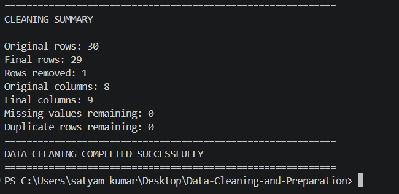
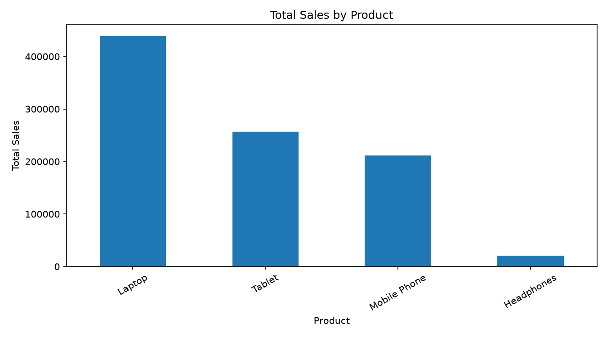
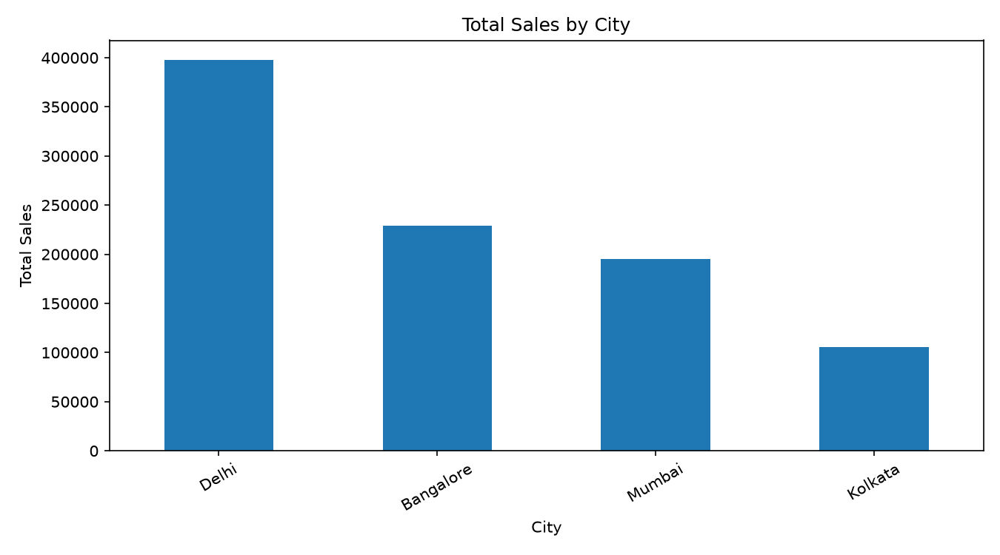
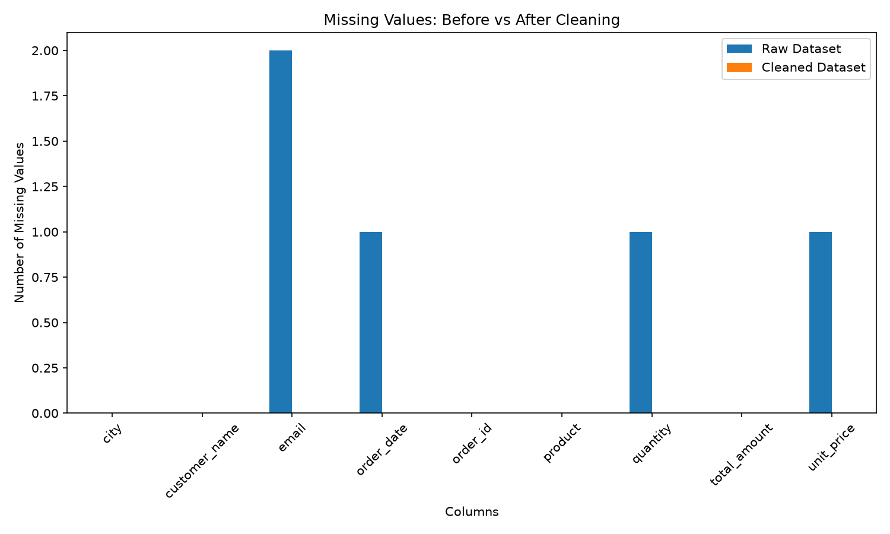

# 🧹 Data Cleaning & Preparation using Python

A practical **Data Cleaning & Preparation** project using Python, Pandas, NumPy and Matplotlib that demonstrates how raw and inconsistent data can be transformed into a clean, structured and analysis-ready dataset.

---

## 📌 Project Overview

Real-world datasets often contain missing values, duplicate records, inconsistent text formats, invalid values and different date formats.

This project demonstrates a complete data cleaning and preparation workflow using Python.

The raw dataset intentionally contains several data-quality problems. These problems are identified, cleaned, validated and transformed into a reliable dataset suitable for further analysis.

---

## 🔄 Workflow

The project follows these steps:

1. Load the raw dataset
2. Inspect the dataset
3. Identify data-quality issues
4. Clean and standardize the data
5. Handle missing values
6. Validate email addresses and numeric values
7. Standardize dates and text fields
8. Remove duplicate records
9. Create derived columns
10. Generate the cleaned dataset
11. Perform basic analysis
12. Visualize the results

---

## 🎯 Objectives

- Inspect the raw dataset
- Identify missing values
- Detect duplicate records
- Clean inconsistent text formats
- Validate email addresses
- Standardize date formats
- Validate numeric values
- Handle missing data
- Remove duplicate business records
- Generate a clean dataset
- Perform basic analysis on the cleaned data
- Visualize important findings

---

## 📁 Dataset

The project uses a synthetic customer sales dataset created specifically for this project.

### Dataset Fields

- Order ID
- Customer Name
- Email
- City
- Order Date
- Product
- Quantity
- Unit Price

The raw dataset contains intentionally introduced data-quality issues to demonstrate the complete cleaning process.

---

## ⚠️ Data Quality Issues

The raw dataset contains the following issues:

- Missing email values
- Missing order dates
- Missing quantity values
- Missing unit price values
- Invalid email addresses
- Inconsistent city names
- Inconsistent product names
- Extra spaces in text fields
- Multiple date formats
- Invalid numeric values
- Duplicate business records

---

## 🧹 Cleaning Transformations

### 1. Column Name Standardization

Column names were converted to lowercase and spaces were replaced with underscores.

**Example:**

`Customer Name` → `customer_name`

---

### 2. Text Cleaning

Leading and trailing spaces were removed from text fields.

---

### 3. City Standardization

City names were converted to a consistent title-case format.

**Example:**

`delhi` → `Delhi`

---

### 4. Product Standardization

Product names were converted to a consistent title-case format.

**Example:**

`mobile phone` → `Mobile Phone`

---

### 5. Email Cleaning

Email addresses were converted to lowercase and unnecessary spaces were removed.

---

### 6. Email Validation

Invalid email addresses were detected using a regular expression and converted to missing values.

---

### 7. Date Standardization

Multiple date formats were converted into a standard format:

`YYYY-MM-DD`

---

### 8. Numeric Validation

Quantity and unit price values were converted to numeric data types.

---

### 9. Invalid Values

Negative quantities and negative prices were considered invalid and converted to missing values.

---

### 10. Duplicate Handling

Business-key duplicates were identified using important fields such as:

- Customer Name
- Email
- Order Date
- Product

Duplicate business records were removed during the cleaning process.

---

### 11. Missing Values

Missing numeric values were filled using median values.

Missing email values were replaced with:

`unknown@example.com`

Missing order dates were filled using the median order date.

---

### 12. Derived Column

A new column was created to calculate the total amount:

```text
total_amount = quantity × unit_price
```

---

## 📊 Results

The cleaning process produced the following results:

| Metric | Before Cleaning | After Cleaning |
|---|---:|---:|
| Rows | 30 | 29 |
| Columns | 8 | 9 |
| Missing Values | 5 | 0 |
| Duplicate Rows | 0 | 0 |

The cleaned dataset contains an additional `total_amount` column for sales analysis.

---

## 📈 Analysis Results

### Product-wise Sales

| Product | Total Sales |
|---|---:|
| Laptop | 439000 |
| Tablet | 256500 |
| Mobile Phone | 211500 |
| Headphones | 20800 |

**Key Finding:** Laptop generated the highest total sales.

---

### City-wise Sales

| City | Total Sales |
|---|---:|
| Delhi | 397800 |
| Bangalore | 229000 |
| Mumbai | 195100 |
| Kolkata | 105900 |

**Key Finding:** Delhi generated the highest total sales.

---

## 📂 Project Structure

```text
Data-Cleaning-and-Preparation/
│
├── data/
│   ├── raw_dataset.csv
│   └── cleaned_dataset.csv
│
├── screenshots/
│   ├── city_sales.png
│   ├── cleaning_output.png
│   ├── missing_values_comparison.png
│   └── product_sales.png
│
├── report/
│
├── src/
│   ├── data_cleaning.py
│   └── data_analysis.py
│
├── analysis_summary.txt
├── cleaning_log.txt
├── create_report.py
├── requirements.txt
├── README.md
└── .gitignore
```

---

## 📸 Screenshots

### 🧹 Data Cleaning Output



---

### 📊 Product-wise Sales



---

### 🏙️ City-wise Sales



---

### 🔍 Missing Values Comparison



---

## 🛠️ Technologies Used

### Programming Languages

- Python
- C
- C++
- JavaScript
- HTML
- CSS

### Data & Analytics

- Pandas
- NumPy
- Matplotlib
- Seaborn
- Exploratory Data Analysis (EDA)
- Data Cleaning
- Data Processing
- Data Visualization

### Web Development

- Node.js
- Express.js
- HTML
- CSS
- JavaScript

### Databases

- SQL
- MongoDB

### Deployment & Hosting

- Render

### Development Tools

- Git
- GitHub
- Visual Studio Code
- Jupyter Notebook

### Data & Productivity

- Microsoft Excel
- CSV
- JSON

---

## ▶️ How to Run

### 1. Clone the repository

```bash
git clone https://github.com/rahulraj2007k-pixel/Data-Cleaning-and-Preparation.git
```

### 2. Open the project folder

```bash
cd Data-Cleaning-and-Preparation
```

### 3. Install the required libraries

```bash
pip install -r requirements.txt
```

### 4. Run the data cleaning script

```bash
python src/data_cleaning.py
```

### 5. Run the data analysis script

```bash
python src/data_analysis.py
```

The cleaned dataset and analysis outputs will be generated by the project scripts.

---

## 👤 Author

### Rahul Kumar

**BCA Student | Python Developer | Data Analytics & Web Development**

Interested in:

- Software Development
- Data Analytics
- Data Visualization
- Web Development
- Problem Solving
- Building practical real-world projects

### Connect With Me

- 💼 [LinkedIn](https://www.linkedin.com/in/rahul-kumar-6340b13a1)
- 🐙 [GitHub](https://github.com/rahulraj2007k-pixel)

---

## ⭐ Thanks for Visiting!

Thanks for checking out my project.

Feel free to explore the repository and other projects.

**Keep Learning • Keep Building • Keep Growing 🚀**
